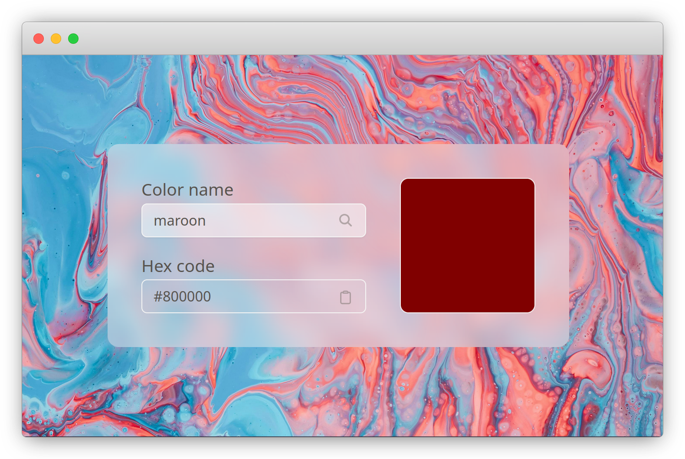

# Color converter
This simple tool converts color names to their corresponding hex codes. It can be used in the browser or the CLI.

## CLI
Ensure [node](https://nodejs.org/en) is installed before using the CLI.
```bash
chmod u+x ./hexcolor.sh
./hexcolor.sh 'navy'
# Output: #01153E
```

## Web
You can also use it in the browser via this [link]().
|          |             |
| :---:    |    :----:   |
|  |  |

## Data
Color data is sourced from [meodai/color-names](https://github.com/meodai/color-names/blob/master/dist/colornames.json), with the following structrue:
```
[
  { "name": "red", "hex": "#ff0000" },
  { "name": "blue", "hex": "#0000ff" },
  ...
]
```
For efficient searching, it's converted to:
```
{
  "red": "#FF0000",
  "blue": "#0000FF",
  ...
}
```
To perform this conversion, do:
```bash
chmod u+x ./generate_colors.sh
./generate_colors.sh
# nameToHex.json has been generated.
```
This converts `data/colornames.json` to `data/nameToHex.json`.

## Tests
Tests are located in the `__tests__/` directory. To run them:
```bash
$ npm run test
```

## Additional resources
- [Background image](https://unsplash.com/photos/a-blue-pink-and-red-liquid-swirl-background-BmAOtpBZpMk)
- [Favicon](https://www.flaticon.com/free-icon/hashtag_7754226?term=hash&page=1&position=28&origin=tag&related_id=7754226)
- [Desktop mockup](https://browserframe.com/)
- [Mobile mockup](https://mockuphone.com/)

